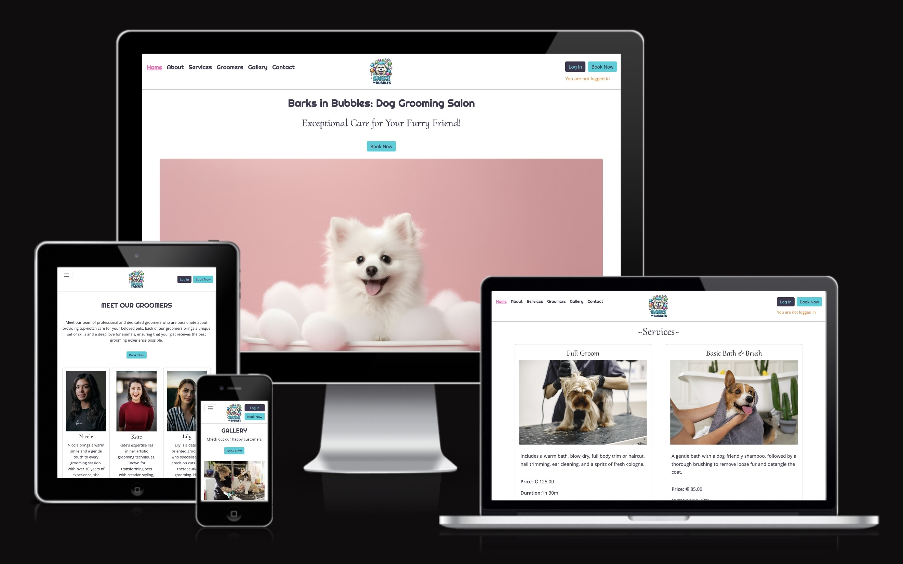
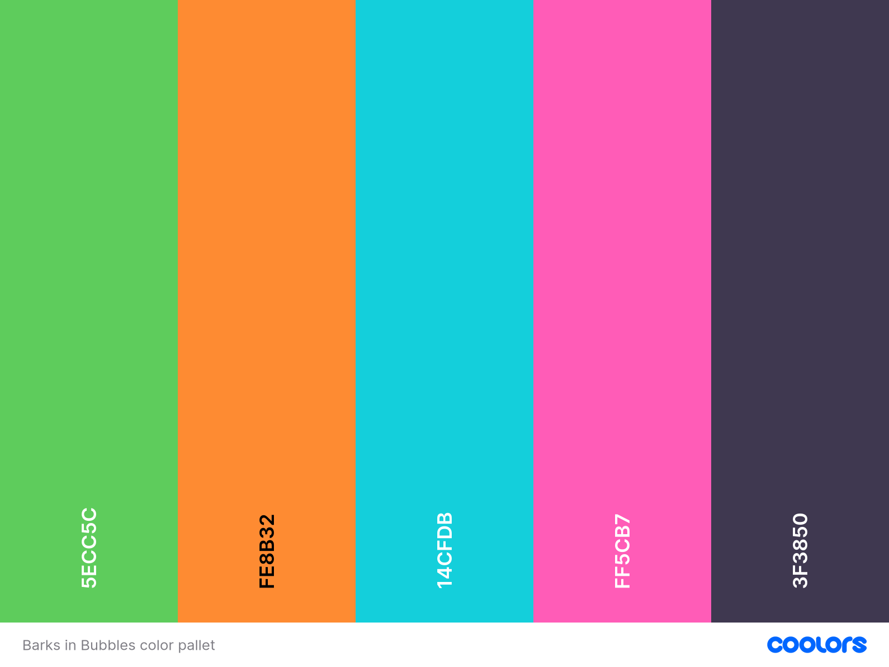

# Barks in Bubbles - Dog Grooming Salon

Barks in Bubbles is a web-based application designed to provide an exceptional dog grooming service in the Cork area through a comprehensive online platform.

The website offers a seamless and user-friendly interface, allowing customers to easily navigate through information about the salon, including services offered, groomer profiles, and a gallery of previous grooming work.

With this application, customers can create personal accounts, book and manage grooming appointments, and contact the salon directly through a contact form.



### Project Link

Live site can be found at the following [address](https://barks-in-bubbles-a17d3839532d.herokuapp.com/).


## Agile Methodology

This project was developed using the Agile methodology, which allows for iterative development and flexibility. The Agile methodology was utilised to plan and track the progress of the project. Agile principles were applied throughout the project through the use of the following tools and principles:

**Planning and Tracking:** 

All user stories were managed through GitHub Issues and Projects, ensuring a structured and organised workflow.

**Custom Templates:**

Issues were created for each user story using custom templates, including sections such as user story, acceptance criteria, and tasks. This standardised the information captured for each story, making it easier to manage and track their progress.

**MoSCoW Method:**

To prioritise tasks, the MoSCoW method (Must have, Should have, Could have, and Won’t have) was implemented usign labels. This can be viewed [here](https://github.com/KatePaulauskas/dog-grooming-salon/issues?q=is%3Aissue+is%3Aclosed). This method helped in labelling the importance of each user story, ensuring that critical features were developed first within an iteration, while less critical features could be developed towards the end of the iteration or scheduled for later, if needed.

**Kanban Board:** 

A Kanban board on GitHub Projects was employed to manage user stories. The board was divided into three columns: Todo, In Progress, and Done, allowing for clear visibility of the project's status at any given time. This can be viewed [here](https://github.com/users/KatePaulauskas/projects/2).

**Milestones and Iterations:**

Milestones were used to define the project’s iterations. Each user story was categorised within one of five iterations, facilitating a structured development process and ensuring that work progresses in an organised manner. Project Milestones can be seen [here](https://github.com/KatePaulauskas/dog-grooming-salon/milestones).

By leveraging these Agile practices and tools, the project maintained a clear and organised structure, allowing for effective tracking and timely completion of all 17 user stories.

## User Experience Design 

The Barks in Bubbles website was crafted using the Five Planes of Web Design approach. This methodology addresses each aspect of the design process, from strategy and scope to structure, skeleton, and surface, creating a positive user experience. By following this structured approach, it was possible to align user needs with business goals, resulting in an inviting, informative, and efficient online platform for pet owners in the Cork area.

### Strategy

When approaching the Strategy Plane, the foundation of the user experience, user needs, and business objectives were taken into consideration. Furthermore, the three main areas of interest in this plane: focus, definition, and value, were identified for the current project.

#### - User Needs -

Understanding the users and their needs was essential. After conducting research, the **target audience** for the Barks in Bubbles website was identified as follows:

* **Pet Owners:** Individuals in the Cork area who are looking for reliable and high-quality grooming services for their dogs.

* **Local Community Members:** Residents near the salon seeking convenient and professional pet grooming services.

* **New Pet Owners:** Individuals who have recently acquired a dog or a puppy and are in need of reliable grooming services in Cork area to introduce the dog to grooming.

* **Returning Pet Owners:** Customers looking for a consistent and reliable dog grooming provider in Cork area to use on a regular basis.

* **Breeders:** Professionals around Cork who require grooming services to maintain the appearance and health of the dogs they are breeding.

* **Exhibition and Competition Participants:** Owners who take part in dog exhibitions and competitions, requiring top-notch grooming services to prepare their dogs for events around Cork.

* **Veterinary Clinics:** Clinics around Cork looking for potential partnerships and referrals to provide comprehensive care for pets.

* **Dog Training Services:** Training providers around Cork area seeking grooming services for their clients' dogs as part of a complete care package.

* **Animal Shelters:** Organisations looking for grooming services to help dogs in their care look their best, increasing their chances of adoption.

These users need a platform that offers comprehensive, reliable, high-quality dog grooming services, including information about the salon, grooming services, and an easy appointment booking and management system.

#### - Business Objectives -

For Barks in Bubbles as a dog grooming salon, the primary objectives were identified. The salon is looking to streamline the grooming appointment process, showcase high-quality services, and build a strong online presence that attracts and retains customers. 

This understanding of user needs and business objectives helped to formulate the project's overall goal.

**Goal**

The primary goal of the Barks in Bubbles website is to streamline the grooming appointment process for pet owners while ensuring an inviting, informative, and efficient online presence that showcases the high-quality services offered.

#### - Focus, Definition, and Value -

**Focus**

For Barks in Bubbles, the focus is to streamline the grooming appointment process for pet owners in the Cork area. The key objectives include providing an inviting, informative, and efficient online presence that showcases the high-quality grooming services offered by the salon. 

**Definition**

It was decided to create a comprehensive online platform for Barks in Bubbles that serves as an informative and user-friendly website for pet owners. This platform will include:

- Detailed information about the salon and its range of grooming services.
- Profiles of groomers, highlighting their expertise.
- An online booking system for scheduling, managing, and editing grooming appointments.
- Contact details and a form for inquiries.
- A visually appealing and easy-to-navigate interface.
- This custom-built website will provide a tailored experience that generic social media platforms cannot offer.

**Value**

The value of the Barks in Bubbles website is multi-faceted:

**For the Business:** The website will increase the salon’s visibility, streamline the appointment process, build a network of satisfied customers, and enhance the salon's reputation for high-quality services.

**For the Users:** Pet owners will have proof of the salon's ability and quality through service descriptions, groomer profiles, and a gallery of previous work. They will experience convenience in booking and managing appointments online and will have confidence in the services provided by the salon.

By focusing on these key areas, the Barks in Bubbles website aims to deliver a positive user experience that meets both business objectives and user needs.


### Scope

At the Scope Plane features and contented were developed through defining User Scenarios to understand how different users will interact with the site as well as Epics and User Stories to break down these scenarios into manageable tasks and features.

### - User Scenarios -

**First Time User:**

A new user can easily navigate through the website with a clear introduction and an intuitive menu. They can learn about the salon's mission, view services offered, explore groomer profiles, and see a gallery of grooming work. They can also create an account and book their first grooming appointment with ease.

**Returning / Frequent User:** 

Returning users can quickly log in to their accounts to view and manage their appointments, view service history, and book new appointments.

**Interested Parties:** 

Veterinary clinics, dog trainers, breeders, and animal shelters can find comprehensive information about the salon's services and expertise. They can view the quality of grooming services through the gallery, and contact the salon for potential collaborations using the dedicated contact form.

### - User Stories -

**Epic 1: Homepage Above Fold and Navigation**

***User Stories:***

- As a Site User, I can see a welcoming message and a catchy image when I first visit the homepage so that I feel engaged and have a positive first impression of the salon.

- As a Site User, I can view information about the salon on the homepage so that I can understand the salon's mission and background.

- As a Site User, I can easily navigate the website through a comprehensive menu located in the header and access site pages so that I can explore the site fully and access my account.

**Epic 2: Information About Services Offered: Services, Groomers & Gallery**

***User Stories:***

- As a Site User, I can view a list of services on the homepage so that I can quickly learn about the different grooming options available.

- As a Site User, I can view information about the groomers on the 'Groomers' page so that I can choose a groomer based on their expertise.

- As a Site User, I can view a gallery of photos on the 'Gallery' page featuring dogs in the process of being groomed or already groomed so that I can see the quality and range of grooming services offered.

**Epic 3: Contact Information and Inquiries**

***User Stories:***

- As a Site User, I can find contact details in the footer on any page of the site so that I can reach out to the salon for further inquiries, to book an appointment, or to know the salon's location and working hours.

- As a Site User, I can access and use the contact form on the 'Contact' page so that I can send inquiries directly to the salon.

- As a Site Owner, I can store contact form requests in the database so that I can review them, mark as read, or delete.

- As a Site Owner, I can mark contact form submission as "read" so that I can track how many I still need to process.

**Epic 4: Account Management**

***User Stories:***

- As a Site User, I can create an account through Log In bar so that I can access personalized services to book and store my appointments.

- As a Site User, I can log in using the Log In bar so that I can easily see and manage my existing bookings or log out.

**Epic 5: Appointment Booking and Management**

***User Stories:***

- As a Site User, I can see multiple entry points to make a booking so that I can easily book a service.

- As a Registered Customer, I can book an appointment so that I can groom my dog.

- As a Registered Customer, I can delete my existing booking so that I can remove an appointment I no longer need.

- As a Registered Customer, I can edit my booking appointment so that I can update or change the details of the appointment or the information I have provided.

- As a Site Owner, I can view and manage all existing bookings so that I can oversee the salon's schedule and make changes or cancel bookings when needed.


### Structure

At the Structure Plane, the information organisation and interaction design were developed by defining the site pages, database structure, and booking flow. 

#### - Site Pages -

The Barks in Bubbles website comprises several key pages, each designed to provide essential information and facilitate user interactions:

**Home Page:**

* Provides an overview of the salon’s mission and background.
* Features a welcoming message and a catchy hero image to engage users.
* Highlights all grooming services offered with descriptions, duration and pricing.
* Provides inks to make a booking

**Groomers Page:**

* Introduces the team of professional groomers.
* Includes profiles of each groomer, highlighting their expertise and experience.
* Helps users choose a groomer based on their qualifications and specialties.

**Gallery Page:**

* Showcases photos of dogs during, and after grooming.
* Provides visual proof of the quality and range of grooming services.
* Engages users by displaying the salon's successful grooming results.

**Appointment Booking Page:**

* Allows users to book grooming appointments online.
* Includes a step-by-step booking process, guiding users through selecting services, picking a date, choosing a groomer and selecting time.

**Contact Page:**

* Contains a contact form for inquiries and feedback.

**Log In and Sign Up Pages:**

* Enables users to create an account or log in to access personalised services.
* Facilitates appointments management tracking.

**All Appointments Page:**

* Accessible to registered users for managing their appointments.
* Displays upcoming and past appointments, allowing users to edit or cancel future bookings as needed.

Each page is designed to provide valuable information and ensure a seamless user experience, making it easy for pet owners to learn about the salon, book appointments, and manage them.

#### - Database Structure -


#### - Booking Flow Chart -


### Skeleton

At the skeleton plane the interface and navigation design was define through wireframes. 

#### Wireframes

The initial layout of the interface and navigation of the Bark in Bubbles website was developed using Balsamiq Studios software, through which a mockup wireframes ware crearted forthe main pages.

**Home page:**


**Groomers page:**


**Gallery page:**


**Contact page:**


**Log In page:**


**Sign Up page:**


**Book Appointment page:**


### Surface
At the Surface Plane the visual design of the site was developed, where more focus was given to the look and feel of the site.

#### Color Scheme

The colors for the Barks in Bubbles site were carefully selected using [Coolors tool](https://coolors.co/) to create an inviting, professional, and engaging atmosphere. 



The chosen color palette, set against a white background, combines freshness, warmth, tranquility, playfulness, and sophistication to create a balanced and appealing environment. Each color plays a specific role in enhancing the customer experience:

- Mantis provides a calming and natural feel.

- UT Orange injects energy and warmth.

- Robin Egg Blue offers tranquility and trustworthiness.

- Hot Pink adds fun and liveliness.

- English Violet lends an air of sophistication and quality.

- The white background ensures that these colors stand out beautifully, contributing to an inviting, professional, and engaging atmosphere that appeals to both pets and their owners. 

Below is a detailed breakdown of the color choices and the reasoning behind them:

**Mantis (#5ecc5c):**

Mantis is a vibrant green color that exudes a sense of freshness and vitality. This color was chosen to evoke feelings of nature, growth, and renewal, which are associated with health and well-being. It represents the care and rejuvenation that pets will experience at the grooming salon. Green is also known for its calming effects, making it a good choice for both pets and their owners.

**UT Orange (#fe8b32):**

UT Orange is a bright, warm orange color that captures attention and adds a touch of energy. Orange is often associated with enthusiasm, creativity, and warmth. This color was selected to create a welcoming and energetic atmosphere in the salon. It can help to make the environment feel friendly and inviting, encouraging customers to feel excited about bringing their pets for grooming services.

**Robin Egg Blue (#14cfdb):**

Robin Egg Blue is a light and refreshing blue color reminiscent of clear skies and calm waters. This color was chosen to convey tranquility, trust, and reliability. Blue is known to have a soothing effect, which is beneficial in a setting where pets may be anxious. It also gives a sense of cleanliness and professionalism, reassuring clients of the high standards of hygiene and care in the salon.

**Hot Pink (#ff5cb7):**

Hot Pink is a bold and playful pink color that adds a fun and energetic vibe. Pink is often associated with compassion, nurturing, and love. The vibrant shade of hot pink was chosen to inject a sense of playfulness and joy into the salon's environment. It reflects the affectionate and caring nature of the services provided, making the space feel lively and engaging.

**English Violet (#3f3850):**

English Violet is a deep, rich violet color that adds depth and sophistication. Violet is traditionally associated with luxury, wisdom, and dignity. This color was chosen to convey a sense of premium quality and elegance. It adds a touch of sophistication to the salon's aesthetic, appealing to clients who value high-quality services and a refined atmosphere.

**White Background (#ffffff):**

The primary background color used throughout the design is white. White is the perfect canvas for highlighting the vibrant and diverse color palette. It provides a clean, crisp, and professional look that enhances readability and ensures that the bright colors stand out without overwhelming the viewer. White backgrounds help create a sense of openness and space, making the salon feel more inviting and less cluttered. It also reinforces the notions of cleanliness and simplicity, which are essential qualities for a grooming salon. 

The combination of these colors ensures that the salon not only stands out visually but also conveys the values and quality of the services provided.

#### Typography

The fonts for the site were carefully selected using font pairing service [Font Joy](https://fontjoy.com/) to create a visually appealing and cohesive design. Each font was chosen to enhance the user experience and align with the brand's identity. 


**Headings (H1)**

The "Righteous" font was chosen for the main headings (H1) to make a bold and memorable first impression. This sans-serif font is playful and modern, reflecting the friendly and approachable nature of Barks in Bubbles. Its distinct style helps to draw attention to the main titles, ensuring that they stand out prominently on the page.

**Subheadings (H2-H4)**

For subheadings (H2-H4), "Cormorant Upright" was selected to provide a sophisticated and elegant look. This font adds a touch of class and refinement to the website, aligning with the high-quality grooming services offered by the salon. The larger font size ensures that these subheadings are easily readable and effectively break up the content into manageable sections.

**Smaller Headings (H5-H6)**

The "Cormorant Upright" font is also used for smaller headings (H5-H6) to maintain consistency across all heading levels. By using the same font family, the website achieves a harmonious and unified look. The smaller size still ensures readability while keeping the overall design cohesive.

**Paragraphs**

For the body text, "Khula" was chosen for its clean and modern appearance. This sans-serif font is easy to read, making it ideal for longer passages of text. The slightly larger font size enhances readability, ensuring that users can comfortably read the content. The font's simplicity complements the more decorative heading fonts, creating a balanced and aesthetically pleasing design.

The combination of "Righteous" for main headings, "Cormorant Upright" for subheadings and smaller headings, and "Khula" for paragraphs creates a well-rounded and visually engaging typography approach for the Barks in Bubbles website. Each font was carefully selected to reflect the brand's personality, enhance readability, and ensure a cohesive user experience. The consistent use of the English Violet color (#3f3850) ties all the text elements together, reinforcing the site's elegant and professional appearance.

## Features

### Existing Features

**Header**

The header contains the navigation bar, logo, and 'Log In' and 'Book Now' buttons. The navigation bar is positioned on the left, while the logo is prominently displayed in the center, ensuring brand recognition. The logo features a drawing of a happy dog in colorful bubbles and foam, representing the brand and providing a clear visual hint about the site's focus on dog grooming.

The 'Log In' and 'Book Now' buttons are positioned on the right side by side, facilitating quick access to appointment booking and management for users. Below these two buttons, there is a notification informing the user whether they are logged in or not.


Once the user is logged in, the 'Log In' and 'Book Now' buttons transform to 'Log Out' and 'Bookings' buttons respectively, and a notification about successful sign-in appears:


**Navigation Bar**

The fully responsive navigation bar is displayed on all site pages. It includes links to four site pages: Home, Groomers, Gallery, and Contact, as well as two anchors on the home page: About and Services. The links look identical and consistent, and the only difference between anchors and pages is evident upon clicking on them.

The design of the navigation bar remains consistent across all pages, ensuring seamless navigation. It allows site visitors to navigate through the site with ease, eliminating the need to use the back button in their browser.

* Desktop View:

The navigation bar links are displayed horizontally with the active page highlighted and underlined, providing a clear indication of the user's current location on the site.


* Tablet and Mobile View:

On tablets and mobile devices, the menu is represented by a hamburger icon.


Clicking on it reveals a dropdown menu showcasing the current page highlighted and underlined to ensure smooth navigation. The menu items are displayed on a full-width background, creating a cohesive block with the header.

The notification informing the user whether they are logged in or not is displayed in the dropdown menu. The 'Log In' and 'Book Now' buttons are positioned vertically to ensure the limited screen space is utilized efficiently.


**Above the Fold**

Upon visiting the Barks in Bubbles website, users are greeted with a welcoming message and a visually appealing hero image with a happy dog in a bathtub. This section is designed to engage users immediately, providing a positive first impression of the salon and its services.


**About Us**

The About Us section provides an insightful overview of the salon's mission, vision, and background. This section highlights the salon's dedication to delivering high-quality grooming services and its commitment to building lasting relationships with clients and their pets.


**Services**

The Services section, displayed on the homepage, highlights all grooming services offered by Barks in Bubbles. It includes detailed descriptions, duration, and pricing for each service, allowing users to quickly learn about the different grooming options available.


**Groomers Page**

The Groomers Page introduces the team of professional groomers and highlights their expertise and experience. This page helps build trust and assurance by showcasing the skills and dedication of the grooming team.


**Gallery Page**

The Gallery Page showcases a collection of photos featuring dogs during and after grooming sessions. This page provides visual proof of the high-quality grooming services offered by the salon and engages users by displaying successful grooming results.


**Contact Us Page**

The Contact Us Page provides a user-friendly contact form for inquiries and feedback. This page is designed to facilitate smooth communication between the salon and its clients, so that clients can easily reach out to the salon for any questions or appointment bookings.


Upon submitting a request through the form, the user gets a notification about successful submission, and the form gets refreshed in case the user would like to send another request:


**Log In Page**

The Log In page allows existing users to access their accounts and manage their appointments. This page ensures secure authentication and provides an easy way for users to log in and access personalized services.


After logging in, customers are taken to the 'All Bookings' page and notified about their successful login:


**Sign Up Page**

If a user does not have an existing account, they can click on the 'Sign Up' link on the "Log In" page. As a result, they are redirected to the 'Sign Up' page, which allows new users to create an account, enabling them to book and manage their appointments online.


After signing up, customers are taken to the 'All Bookings' page and notified about their successful login:


**Log Out Page**

Upon clicking on the Log Out button in the header, the user is taken to the Sign Out page, where they have to confirm their intent to sign out:


Upon confirmation, the user is redirected to the home page and notified of their successful action:


**All Bookings Page**

If the user is logged in, there are two scenarios for the 'All Bookings' Page.

* If a customer does not have any appointments scheduled yet, they are redirected to the 'All Bookings' Page, where it says that they have no appointments scheduled. They are presented with the 'Book Appointment' button underneath the notification:


* If a customer already has scheduled appointments, they see the list of their appointments, as well as 'Book New Appointment' buttons:


* Superuser sees additional information on the 'All Bookings' Page, such as usernames:


Users, as well as superusers, have an option to edit or delete their future bookings. Whereas the older bookings editing options are grayed out.
 

**Book Appointment Page**


**Editign and deletign appointents**


**Footer**

The footer is displayed at the bottom of every page and contains essential information and links:

* Working Hours: Information about the salon's operating hours.
* Contact Details: Phone number and email address for inquiries.
* Address: Physical location of the salon.
* Social Media Links: Icons linking to the salon's Instagram and Facebook pages, allowing users to connect with the salon on social platforms.


### Future Features

1. Implement validation against double bookings and overlapping appointments in the admin panel when editing or scheduling appointments.
2. Add functionality to respond to inquiries via email from the admin panel.
3. Enable password recovery and reset functionality for existing users.
4. Implement email notifications for when an appointment is booked, rescheduled, or deleted.
5. Offer services with different durations and adjust the booking flow accordingly.
6. Implement functionality to ensure certain services are performed only by specific groomers.
7. Add a notes field for superuser to be able to add comments to appointments.
8. Provide more tailored services, taking into consideration the dog’s breed and size.

## Technologies used

### Languages
### Frameworks
### Database

## Testing

### Manual Testing
#### Site features and behaviour
### Feature Testing

| Action/Feature          | Expected Behavior       | Status         |
|-------------------------|-------------------------|----------------|
| Enter site URL: <https://barks-in-bubbles-a17d3839532d.herokuapp.com/> | Home page loads | Pass |
| Menu was tested on all pages of the site on multiple devices: mobile, tablet, desktop |  |  |
| Click on the Home page link | Home page loads | Pass |
| Click on the About link on the Home page | Scrolls to About section | Pass |
| Click on the Services link on the Home page | Scrolls to Services section | Pass |
| Click on the Groomers page link | Groomers page loads | Pass |
| Click on the Gallery page link | Gallery page loads | Pass |
| Click on the Contact page link | Contact page loads | Pass |
| Click on the hamburger menu icon on the mobile or tablet devise | Menu items expand inside the header in a dropdown | Pass |
| Hamburger menu icon on larger screens | Hidden | Pass |
 Click on the logo | Home page loads | Pass |
| Header buttons were tested on all pages of the site on mobile, tablet, desktop |  |  |
| Click on the Log In button | Log In page loads | Pass |
| Click on the Book Now button | 'Log in here to book your appointment' notification appears| Pass |
| Notification about user login status | Correctly displays user login status | Pass |
| Form was tested on on mobile, tablet, desktop devices in multiple browsers |  |  |
| Click submit without filling out fields | "Please fill in this field" appears in the 'Name' field | Pass |
| Fill out only the name, and click submit | "Please fill in this field" appears in the 'Email' field | Pass |
| Fill out the name and email fields without the '@' sign, and click submit | "Please include an '@' in the email address. 'email' is missing an '@'" appears in the 'Email' field | Pass |
| Fill out the name and email address with the '@' sign, and click submit | "Please fill in this field" appears in the 'Message' field | Pass |
| Fill out the name, email address with the '@'sign and add a message, click submit | The notification "Thanks for reaching out! We got your message and will be in touch within 24 hours." displayed at the top of the screen | Pass |
| Footer links were tested on all site pages |  |  |
| Click on the Instagram icon in the footer | External link leading to Instagram opens in a new page | Pass |
| Click on the Facebook icon in the footer | External link leading to Facebook opens in a new page | Pass |

#### Book Now Buttons

| Action/Feature          | Expected Behavior       | Status         |
|-------------------------|-------------------------|----------------|
| Click on the Book Now button in the header of the site while logged out | User is taken to a separate page where the message "Log in here to book your appointment" is displayed | Pass |
| Click on the Book Now button at the top / bottom of the Home page while logged out | In both cases, user is taken to a separate page where the message "Log in here to book your appointment" is displayed | Pass |
| Click on the Book Now button at the top / bottom the Groomers page while logged out | User is taken to a separate page where the message "Log in here to book your appointment" is displayed | Pass |
| Click on the Book Now button at the top / bottom the Gallery page while logged out | User is taken to a separate page where the message "Log in here to book your appointment" is displayed | Pass |


#### Log In Page

| Action/Feature          | Expected Behavior       | Status         |
|-------------------------|-------------------------|----------------|
| Click Log In button in the header of the site | Log In page loads | Pass |
| Click Log In without filling in any fields | Error message "Please fill in this field" is displayed in the username field | Pass |
| Enter only username and click Log In | Error message "Please fill in this field" is displayed next to the password field | Pass |
| Enter only password and click Log In | Error message "Please fill in this field" is displayed next to the username field | Pass |
| Enter invalid username and password, click Log In | Error message "The username and/or password you specified are not correct" is displayed | Pass |
| Enter valid username and password, click Log In | User is redirected to All Bookings list. The following message displayed "Successfully signed in as 'username'" | Pass |


#### Sign Up Page

| Action/Feature          | Expected Behavior       | Status         |
|-------------------------|-------------------------|----------------|
| Click 'Sign Up' link on the Login Page | Sign Up page loads | Pass |
| Leave required fields empty and click Sign Up | Error messages "Please fill in this field" are displayed next to the username fields | Pass |
| Enter only username and click Sing Up | Error message "Please fill in this field" is displayed next to the password field | Pass |
 Enter only password and click Sing Up | Error message "Please fill in this field" is displayed next to the username field | Pass |
| Enter username and password, click Sing Up | Error message "Please fill in this field" is displayed next to the password (again) field | Pass |
|Enter username, password, password (again) and already used email (ekaterina.paulauskas@gmail.com) and click Sign Up | Error message "A user is already registered with this email address" is displayed | Pass |
| Enter username, a password and password (again) that is less than 8 characters and click Sign Up | Error message "This password is too short. It must contain at least 8 characters." is displayed | Pass |
| Enter username, a password and password (again), use a common password and click Sign Up | Error message "This password is too common." is displayed | Pass |
| Enter username, a password and password (again), use a numeric password and click Sign Up | Error message "This password is entirely numeric." is displayed | Pass |
| Enter username, a password and password (again), use a password similar to personal information and click Sign Up | Error message "Your password can’t be too similar to your other personal information." is displayed | Pass |
| Enter username, a password and password (again), use different passwords for password and password (again) and click Sign Up | Error message "You must type the same password each time." is displayed | Pass |
| Fill out all fields correctly: enter username, a password and password (again), use the same passwords, if addign email, add email that was not previously registed and click Sign Up | User is redirected to the appointment booking page | Pass |

#### Log Out Page

| Action/Feature          | Expected Behavior       | Status         |
|-------------------------|-------------------------|----------------|
| Click 'Log Out' button in the header | Redirects to Log Out confirmation page | Pass |
| Confirm log out  by clicking on 'Log Out' button | Redirects to Home page, notification about successful logout displayed | Pass |

#### Book Appointment Page

| Action/Feature          | Expected Behavior       | Status         |
|-------------------------|-------------------------|----------------|
| Click on any 'Book Now' button while logged out | User is redirected to login page with message: "Log in here to book your appointment" | Pass |
| Click on any 'Book Now' button while logged in | User is redirected to the booking appointment form. Step one of the booking form loads with options to select service and date. Options to 'Cancel' or move to the 'Next' step available | Pass |
| In the step one click on 'Cancel' option | Booking is cancelled, user is directed to the All Bookings Page | Pass |
| Click on 'Next' button in the step one | A notification 'Please select an item in the list' appears in the Services dropdown list | Pass |
| Select Service form the dropdown list and click on 'Next' button in the step one | 'Please fill in this field' appears in the Date dropdown | Pass |
| Select Service form the dropdown list and select a past date in step one then  click 'Next' | Error message "Not possible to select date in the past" is displayed | Pass |
| Select Service form the dropdown list and select a date more than 90 days ahead in step one and click 'Next' | Error message "Not possible to select a date more than 90 days in advance" is displayed | Pass |
| Book an appointment for today after salon closing hours (after 5:30pm on weekday or after 4pm on weekend). Select Service form the dropdown list and select today's date in step one and click 'Next' | Error message "Not possible to book for today as the salon is already closed" is displayed | Pass |
| Select Service form the dropdown list and select a date within next 90 days and click 'Next' | Step two of the booking form loads with options to select a groomer. Options to go to the 'Prev step', 'Next' or 'Cancel' are available | Pass |
| Click on 'Prev step' in Step two | 'Please select an item in the list' appears in the Groomers dropdown list. After selectign a groomer, and clicking on 'Prev step' again, user is directed back to step one with previously entered service and date details retained | Pass |
| Click on 'Cancel' in Step two | Booking process is cancelled, user is directed to 'All Bookings' page | Pass |
| Click on 'Next' in Step two | 'Please select an item in the list' appears in the Groomers dropdown list | Pass |
| Select a groomer in step two and click 'Next' | Step three of the booking form loads with available time slots. Options to go to the 'Prev step', 'Cancel' or 'Submit' are available | Pass |
| Click 'Prev step' in step three | User is directed back to step two with previously selected groomer retained | Pass |
| Click 'Cancel' in step three | Booking process is cancelled, user is directed to 'All Bookings' page | Pass |
| In step three, select a time slot and click 'Submit' | Appointment is successfully booked, user is directed to 'All Bookings' page with a confirmation message: "Thank you for booking your appointment!" | Pass |

#### All Bookings Page

| Action/Feature          | Expected Behavior       | Status         |
|-------------------------|-------------------------|----------------|
| New user has signed up to the site | 'All Bookings' page loads with the message "No appointments scheduled". 'Book Appointment' button displayed | Pass   |
| User with no appointments has logged in  |  'All Bookings' page loads with the message "No appointments scheduled". 'Book Appointment' button displayed | Pass   |
| User with scheduled appointments has logged in | 'All Bookings' page lists all appointments with 'Book New Appointment' buttons displayed | Pass   |
| Superuser logs in to the site |  'All Bookings' page lists all appointments with 'Book New Appointment' buttons displayed. Superuser can see users' name associated with the appointments  | Pass |
| Click on 'Delete' next to any future appointment | A pop-up window appears asking: 'Delete appointment? Are you sure you want to delete this appointment? This action cannot be undone.' Options to close or confirm delete are available | Pass |
| Click on 'Delete' next to any future appointment, in the pop-up window click 'Delete' button | The appointment is deleted, and the user is redirected to the 'All Bookings' page with a confirmation message: 'Appointment deleted!'| Pass |
| Click on 'Delete' next to any future appointment, in the pop-up window click 'Close' button | The pop-up window is closed, and no changes are made to the appointment | Pass |
| Click on Edit next to any future appointment | Step one of the booking form loads with the prefilled details of the appointment. Service and date can be changed from the dropdown. Options to 'Cancel' or move to the 'Next' step available | Pass |
| Click on Edit next to any future appointment. Step one of the booking form loads with the prefilled details of the appointment. Service and date can be changed from the dropdown. Click on 'Cancel' option | Editing is cancelled, user is directed to the All Bookings Page | Pass |
| After 5:30pm on weekday or after 4pm on weekend click on Edit next to any future appointment. Step one of the booking form loads with the prefilled details of the appointment. In step one change 'service' and 'date', select today's date | Error message "Not possible to book for today as the salon is already closed" is displayed	| Pass |
| Click on Edit next to any future appointment. Step one of the booking form loads with the prefilled details of the appointment. In step one change 'service' and 'date', choose a past date | Error message "Not possible to select date in the past" is displayed | Pass |
| Click on Edit next to any future appointment. Step one of the booking form loads with the prefilled details of the appointment. In step one change 'service' and 'date', choose a date more than 90 days ahead | Error message "Not possible to select a date more than 90 days in advance" is displayed | Pass |
| Click on Edit next to any future appointment. Step one of the booking form loads with the prefilled details of the appointment. In step one change 'service' and 'date', select date within next 90 days, then click 'Next' | Step two of the booking form loads with the prefilled groomer name (if available on that date, or the dropdown is blank). Groomer name can be changed from the dropdown. Options to go to the 'Prev step', 'Next' or 'Cancel' are available | Pass |
| Click on Edit next to any future appointment. Step one of the booking form loads with the prefilled details of the appointment. In step one change 'service' and 'date', select date within next 90 days, then click 'Next'. Step two of the booking form loads with the prefilled groomer name (if available on that date, or the dropdown is blank). Click on 'Prev step' in Step two | User is directed back to Step one with the previously entered service and date details retained, if groomer name is selected, otherwise user needs to select groomer to be able to go to the previous step | Pass |
| Click on Edit next to any future appointment. Step one of the booking form loads with the prefilled details of the appointment. In step one change 'service' and 'date', select date within next 90 days, then click 'Next'. Step two of the booking form loads with the prefilled groomer name (if available on that date, or the dropdown is blank). Click on 'Cancel' in Step two | Editing is cancelled, user is directed to the All Bookings Page | Pass |
| Click on Edit next to any future appointment. Step one of the booking form loads with the prefilled details of the appointment. In step one change 'service' and 'date', select date within next 90 days, then click 'Next'. Step two of the booking form loads with the prefilled groomer name (if available on that date, or the dropdown is blank). Change/select groomer. Click on 'Next' in Step two | Step three of the booking form loads with the available time slots. Options to go to the 'Prev step', 'Cancel' or 'Submit' are available | Pass |
| Click on Edit next to any future appointment. Step one of the booking form loads with the prefilled details of the appointment. In step one change 'service' and 'date', select date within next 90 days, then click 'Next'. Step two of the booking form loads with the prefilled groomer name (if available on that date, or the dropdown is blank). Change/select groomer. Click on 'Next' in Step two. Step three of the booking form loads with the available time slots. Click on 'Prev step' in Step three | User is directed back to Step two with the previously entered groomer name retained  | Pass |
| Click on Edit next to any future appointment. Step one of the booking form loads with the prefilled details of the appointment. In step one change 'service' and 'date', select date within next 90 days, then click 'Next'. Step two of the booking form loads with the prefilled groomer name (if available on that date, or the dropdown is blank). Change/select groomer. Click on 'Next' in Step two. Step three of the booking form loads with the available time slots. Click on 'Cancel' in Step three | Editing is cancelled, user is directed to the All Bookings Page | Pass |
| Click on Edit next to any future appointment. Step one of the booking form loads with the prefilled details of the appointment. In step one change 'service' and 'date', select date within next 90 days, then click 'Next'. Step two of the booking form loads with the prefilled groomer name (if available on that date, or the dropdown is blank). Change/select groomer. Click on 'Next' in Step two. Step three of the booking form loads with the available time slots. Select a time slot in Step three from the dropdown or keep the offered time slot, click 'Submit' | Appointment is successfully updated, user is directed to the 'All Bookings' Page with a confirmation message: 'Thank you for booking your appointment!' | Pass |
| Try to edit any past bookings, before today's date | Editing option for older bookings are grayed out| Pass |
| Try to edit any past bookings, before today's date | Delete options for older bookings are grayed out| Pass |

#### User Stories
| User Story | Expected Behavior  | Actual Behavior | Status |
|------------|-------------------|----------------|-----------|
| As a Site User, I can see a welcoming message and a catchy image when I first visit the homepage so that I feel engaged and have a positive first impression of the salon.| The homepage shows a welcoming message and a catchy image upon first visit. | The homepage shows the welcoming message and the catchy image as expected. | Passed|
| As a Site User, I can view information about the salon on the homepage so that I can understand the salon's mission and background. | The homepage displays the salon's mission and background information clearly. | The homepage displays the salon's mission and background information as expected. | Passed|
| As a Site User, I can easily navigate the website through a comprehensive menu located in the header and access site pages so that I can explore the site fully and access my account. | The header menu is comprehensive, functional, and allows access to all site pages and user account. | The header menu is functional and allows access to all pages and user account. | Passed|
| As a Site User, I can view a list of services on the homepage so that I can quickly learn about the different grooming options available.  | The homepage lists all grooming services available, clearly and accessibly. | The homepage lists all grooming services as expected. | Passed|
| As a Site User, I can view information about the groomers on the 'Groomers' page so that I can choose a groomer based on their expertise.  | The 'Groomers' page provides information about each groomer and their expertise. | The 'Groomers' page provides information as expected. | Passed|
| As a Site User, I can view a gallery of photos on the 'Gallery' page featuring dogs in the process of being groomed or already groomed so that I can see the quality and range of grooming services offered. | The 'Gallery' page displays photos of dogs being groomed or already groomed, showcasing the quality of services. | The 'Gallery' page displays photos of dogs as expected. | Passed|
| As a Site User, I can find contact details in the footer on any page of the site so that I can reach out to the salon for further inquiries, to book an appointment, or to know the salon's location and working hours.  | Contact details are visible in the footer on every page, providing information for inquiries, booking, and location. | Contact details are visible in the footer on every page as expected. | Passed|
| As a Site User, I can access and use the contact form on the 'Contact' page so that I can send inquiries directly to the salon.  | The 'Contact' page contains a functional contact form that allows users to send inquiries directly to the salon. | The 'Contact' page contains a functional contact form as expected. | Passed|
| As a Site Owner, I can store contact form requests in the database so that I can review them, mark as read, or delete. | Contact form submissions are stored in the database and can be reviewed, marked as read, or deleted by the owner.  | Contact form submissions are stored in the database and can be reviewed, marked as read, or deleted as expected. | Passed|
| As a Site Owner, I can mark contact form submission as "read" so that I can track how many I still need to process. | The site owner can mark contact form submissions as "read" to track processing status. | Contact form submissions can be marked as "read" to track processing status as expected. | Passed|
| As a Site User, I can create an account through the Log In bar so that I can access personalised services to book and store my appointments.  | Users can create an account through the Log In bar to access personalised services and manage appointments. | Account creation through the Log In bar works as expected. | Passed|
| As a Site User, I can log in using the Log In bar so that I can easily see and manage my existing bookings or log out. | Users can log in through the Log In bar to view and manage bookings or log out. | Logging in through the Log In bar works as expected. | Passed|
| As a Site User, I can see multiple entry points to make a booking so that I can easily book a service. | Multiple entry points for booking are available throughout the site, making it easy for users to book services. | Multiple entry points for booking are available as expected. | Passed|
| As a Registered Customer, I can book an appointment so that I can groom my dog. | Registered customers can book grooming appointments through the site. | Booking an appointment works as expected. | Passed|
| As a Registered Customer, I can delete my existing booking so that I can remove an appointment I no longer need. | Registered customers can delete their existing bookings. | Deleting an existing booking works as expected. | Passed|
| As a Registered Customer, I can edit my booking appointment so that I can update or change the details of the appointment or the information I have provided.  | Registered customers can edit their existing bookings to update or change details.| Editing an existing booking works as expected. | Passed|
| As a Site Owner, I can view and manage all existing bookings in the admin panel, so that I can oversee the salon's schedule and make changes or cancel bookings when needed.  | The site owner can view and manage all bookings, including making changes or cancellations in the admin panel. | Viewing and managing all bookings through admin panel works as expected for the site owner. | Passed|

### Validator Testing

#### HTML

To ensure adherence to web standards and improve accessibility, the site's HTML was submitted to [W3C validation testing](https://validator.w3.org/nu/?doc=https%3A%2F%2Fbarks-in-bubbles-a17d3839532d.herokuapp.com%2F#l163c273).

The following erros were identified and addressed:

- **Error 1:** There were multiple warnings about trailing slashes on void elements, which were fixed by removing the trailing slashes and extra spaces.

- **Error 2:** On the home page, the following issue was identified: 

```
Error: No 'p' element in scope but a 'p' end tag seen.
```


It was identified that the issue was caused by Summernote styling, and after removing paragraph styling from the service descriptions in Summernote, the issue was resolved:


- __Error 3:__ The second step of the booking process resulted in the following error:


After adding the following 'if' statement to validate the required information in booking step two:

```python
if not service_id or not groomer_id or not date_str:
        messages.error(request, "Required information is missing."
                       "Please start from the beginning.")
        return redirect('book_appointment_step_one')
```
The issue was resolved: 


The rest of the pages passed validation with no errors.


#### CSS

For compliance with web standards and accessibility guidelines, the site's CSS code was checked using the [(Jigsaw) validator](https://jigsaw.w3.org/css-validator/validator?uri=https%3A%2F%2Fbarks-in-bubbles-a17d3839532d.herokuapp.com%2F&profile=css3svg&usermedium=all&warning=1&vextwarning=&lang=en). No errors were identified.


434 warning were identified:


These warnings can be grouped in 3 main categories: 

- ***Vendor Extensions and CSS Variables:*** These warnings are necessary for ensuring cross-browser compatibility and are handled by Bootstrap.

- ***Deprecated Properties:*** These warnings are managed by the Bootstrap team.

- **Color Warnings:** State that the same color was used for background and border. These warnings do not affect the site intended design and therefore can be ignored.

#### JavaScript

To enhance adherence to web standards and ensure accessibility, the site's JavaScript code was validated using the [JSHint Validator](https://jshint.com/). No errors were identified in the JavaScript code.

14 Warnings were idenitified:


All the warnings are **ES6 Features Warnings**

- Description: These warnings indicate that the JavaScript code uses features that are only available in ECMAScript 6 (ES6) or later versions.

- Solution: The code should be interpreted as ES6. Having Python runtime version specified in the runtime.txt file helps to address this warning. 

#### Python

To ensure conformity with web standards and accessibility requirements, the site's Python code from every relevant file was tested using the [PEP8 Python Validator](https://pep8ci.herokuapp.com). 

Five types errors were identified on multiple pages:


The errors were addressed, as described below:

**1. W293: Blank Line Contains Whitespace**
- Description: This warning indicates that there are blank lines in the code that contain spaces or tabs.
- Resolution: All the blank lines with whitespace were cleared to contain no spaces or tabs.

**2. W291: Trailing Whitespace**
- Description: This warning indicates that there are extra spaces or tabs at the end of a line.
- Resolution: All the trailing whitespaces were removed from the end of each line with such an error.

**3. E302: Expected 2 Blank Lines, Found 1**
- Description: This error indicates that the code is missing a blank line. PEP 8 recommends two blank lines before the start of a new top-level function or class.
- Resolution: Added the necessary blank lines to ensure there are two blank lines before the start of each top-level function or class.

**4. E501: Line Too Long (93 > 79 Characters)**
- Description: This error occurs when a line exceeds the recommended maximum length of 79 characters.
- Resolution: Lines with such error were broken into multiple lines using parentheses or string concatenation.

**5. E128: Continuation Line Under-Indented for Visual Indent**
- Description: This error occurs when a continuation line (following an opening parenthesis) is not indented correctly.
- Resolution: It was ensured that continuation lines with such error are indented to the same level as the opening parenthesis.

After testign each file with Python code, no more errors were found: 


### Responsivness
### Lighthouse Testing
### Accessibility Testing

### Bugs

#### Solved Bugs

The application encountered two main issues when attempting to get a responsive mockup on [Am I Responsive](https://ui.dev/amiresponsive):


**1. Mixed Content Errors:**

```
Mixed Content: The page at '<URL>' was loaded over HTTPS, but requested an insecure element '<URL>'. This request was automatically upgraded to HTTPS
```

**2. X-Frame-Options Deny:**

```
Refused to display 'https://barks-in-bubbles-a17d3839532d.herokuapp.com/' in a frame because it set 'X-Frame-Options' to 'deny'
```

The application could not be displayed in a frame because of the X-Frame-Options header set to 'deny'. This security measure prevents the site from being embedded in an iframe, causing issues for certain use cases where framing the site is necessary.


***SOLUTIONS***

**1. Mixed Content Errors:**
Configured Cloudinary to ensure that all URLs are generated with HTTPS by setting the secure parameter to True in the Cloudinary configuration using instructions from [Stack Overflow](https://stackoverflow.com/questions/48508750/how-to-force-https-in-a-django-project-using-cloudinary).

```python
import cloudinary 
import cloudinary.uploader 
import cloudinary.api

# Ensures URLs are generated with HTTPS
cloudinary.config(
    secure=True
)
```
Updated the `base.html` template to ensure it uses the Cloudinary template tag:

```

```

**2. Modified X-Frame-Options Header:**

Changed the X_FRAME_OPTIONS setting in Django to allow framing from the project  domain using instructions from [MDN Web Docs](https://developer.mozilla.org/en-US/docs/Web/HTTP/Headers/X-Frame-Options):

```python
# Set the X-Frame-Options header value
X_FRAME_OPTIONS = 'ALLOW-FROM https://barks-in-bubbles-a17d3839532d.herokuapp.com/'

```

### Remaining Bugs

In step two of the booking process, during the initial booking, users must choose a groomer to go back to the previous step. If a groomer is not selected, a notification stating 'Please select an item in the list' appears. The same issue occurs during the editing of an appointment. If the previously selected groomer is unavailable on the selected date, the groomer dropdown is blank. To proceed back to step one, the user must select a groomer. Although this is part of the validation process, it does not provide the best user experience. This bug remains unresolved due to time constraint.


## Deployment

The Dog Grooming Salon 'Barks in Bubbles' website is hosted on Heroku, a container-based cloud platform designed for app development, deployment, and management. It was deployed following the steps below.

### Part 1: Create a New App

1. **Log into Heroku Account**

2. **Create a New App:**
   - Select 'New' in the top-right corner of the Heroku Dashboard.
   - Choose 'Create new app' from the dropdown menu.
   - Enter the app name 'barks-in-bubbles' and select Europe as the region.
   - Click 'Create App'.

3. **Access Settings and Configure Environment Variables:**
   - Go to the 'Settings' tab of the created app.
   - Click on 'Config Vars'.
   - Add the `DISABLE_COLLECTSTATIC` key with a value of `1`.
   - Click 'Add'.
   - Add the `CLOUDINARY_URL` key with a value in the following format: `cloudinary://<api_key>:<api_secret>@<cloud_name>`.
   - Click 'Add'.
   - Add the `DATABASE_URL` key with a value in the following format: `postgres://<username>:<password>@<host>:<port>/<dbname>`.
   - Click 'Add'.

### Part 2 - Update Code for Deployment

1. **Prepare Dependencies:**
   - In the workspace terminal, run the command to create a `requirements.txt` file with the project's dependencies for each project dependency, while working on the project:
     ```
     pip3 freeze --local > requirements.txt
     ```

2. **Install Gunicorn:**
   - Install the web server Gunicorn:
     ```
     pip3 install gunicorn~=20.1
     ```
   - Add Gunicorn to the project requirements:
     ```
     pip3 freeze --local > requirements.txt
     ```

3. **Create a Procfile:**
   - Create a `Procfile` at the root directory of the project.
   - Declare the process as `web` and add a start command:
     ```
     web: gunicorn codestar.wsgi
     ```

4. **Update Project settings.py File:**
   - Change `DEBUG` to `False`:
     ```
     DEBUG = False
     ```
   - Add `'.herokuapp.com'` to the `ALLOWED_HOSTS` in the project settings:
     ```
     ALLOWED_HOSTS = [
         '8000-katepaulaus-doggrooming-98d5mf21glf.ws.codeinstitute-ide.net',
         '.herokuapp.com'
     ]
     ```

5. **Push Updated Code to GitHub**

### Part 3 - Deployment with Static Files

To ensure the deployed app looks as nicely styled as the local development version, the project was deployed with static files using the WhiteNoise Python package by following the steps below:

1. **Install and Set Up the Python Package:**
   - Install WhiteNoise:
     ```
     pip3 install whitenoise~=5.3.0
     ```
   - Add WhiteNoise to the project requirements:
     ```
     pip3 freeze --local > requirements.txt
     ```
   - Integrate WhiteNoise into Django's `MIDDLEWARE` in the `groomingsalon/settings.py` file, ensuring it is placed right after the Django `SecurityMiddleware`:
     ```
     MIDDLEWARE = [
         'django.middleware.security.SecurityMiddleware',
         'whitenoise.middleware.WhiteNoiseMiddleware',
         # Other middleware...
     ]
     ```

2. **Create a Static Files Directory and Collect Static Files:**
   - Set the `STATIC_ROOT` path in the `groomingsalon/settings.py` file:
     ```
     STATIC_ROOT = os.path.join(BASE_DIR, 'staticfiles')
     ```
   - Run the `collectstatic` command in the terminal to gather static files into the `staticfiles` directory:
     ```
     python3 manage.py collectstatic
     ```

3. **Deployment:**
   - Check the Python version by running:
     ```
     python3 -V
     ```
   - From the [supported runtimes](https://devcenter.heroku.com/articles/python-support#specifying-a-python-version), copy the runtime closest to the current Python version.
   - Add a `runtime.txt` file to the project's root directory with the copied Python version: `python-3.12.4`.
   - Set `DEBUG` to `False` and push the changes to GitHub.
   - Open the Heroku dashboard, go to the app 'Settings' tab, and under 'Reveal config vars', remove the `DISABLE_COLLECTSTATIC` key/value pair.

### Part 4 - Set Up Deployment from GitHub

1. **Set Up Deployment from GitHub:**
   - In the Heroku dashboard switch to the 'Deploy' tab.
   - Choose 'GitHub' as the deployment method and connect the GitHub account.
   - In the search bar, type the repository name `dog-grooming-salon` and click 'Search' to find it on GitHub.
   - Click 'Connect' to link the Heroku app to the GitHub repository.

2. **Deploy the App:**
   - Click 'Deploy Branch' to manually deploy the app.
   - Wait for the app to build. Once ready, the message “Your app was successfully deployed” appears.

3. **View Deployed App:**
   - Click on the 'View' button to see the deployed project.

The deployed project link can be found at the following URL: [Dog Grooming Salon: Barks in Bubbles](https://barks-in-bubbles-a17d3839532d.herokuapp.com/).


## Credits

### Code Development

- To center the logo position in the header, the transform on the logo in the header was used: [SheCodes](https://www.shecodes.io/athena/121718-how-to-use-transform-translate-50-50-to-center-an-element-in-css121718-how-to-use-transform-translate-50-50-to-center-an-element-in-css).
- Visited state for the buttons in the header was set using instructions from [MDN Web Docs](https://developer.mozilla.org/en-US/docs/Web/CSS/:visited).
- Buttons' background after the visited state was set following instructions from [Stack Overflow](https://stackoverflow.com/questions/28471219/issue-with-background-color-of-a-button-after-visited-state).
- Redirect to the Appointment booking page after a user is logged in was set using instructions from [Real Python](https://realpython.com/django-redirects/).
- The `get_context_data` method was used to include multiple models' data in a Django class-based view for the home page following instructions from [Django Documentation](https://docs.djangoproject.com/en/5.0/topics/class-based-views/generic-display/#adding-extra-context).
- To avoid 's' being appended at the end of the model name in the Django admin panel, the `Meta` class was added to the models following instructions from [Django Documentation](https://docs.djangoproject.com/en/5.0/ref/models/options/#verbose-name-plural).
- To set the choices argument for the appointment status field in the admin panel, the instructions from [ZeroToByte](https://zerotobyte.com/django-choices-best-practices/) were used.
- To set the date field with a calendar widget on the booking form, the instructions were used from [Python Assets](https://pythonassets.com/posts/date-field-with-calendar-widget-in-django-forms/).
- To specify how the time field should be handled within the booking form, the instructions were followed from [Django Documentation](https://docs.djangoproject.com/en/5.0/ref/forms/fields/).
- To prevent past date booking, the `clean` method was used for the date validation logic following the example here: [Stack Overflow](https://stackoverflow.com/questions/4941974/django-how-to-set-datefield-to-only-accept-today-future-dates).
- To store messages in the booking flow, the request object was used: [Sayari3](https://sayari3.com/articles/16-how-to-pass-user-object-to-django-form/).
- To convert the date into the day of the week and dynamically fetch the corresponding start and end times of a groomer, the following sources were used: [Programiz](https://www.programiz.com/python-programming/datetime/strftime) and [Stack Overflow](https://stackoverflow.com/questions/51905712/how-to-get-the-value-of-a-django-model-field-object).
- To store the selected service, groomer, and date in the session to be used in step two of the booking process, the following resources were used: [Django Tutorial On How To Create A Booking System For A Health Clinic](https://blog.devgenius.io/django-tutorial-on-how-to-create-a-booking-system-for-a-health-clinic-9b1920fc2b78) and Django Documentation: [Working with Forms](https://docs.djangoproject.com/en/5.0/topics/forms/) & [Form and Field Validation](https://docs.djangoproject.com/en/5.0/ref/forms/validation/).
- To retrieve the selected service, groomer, and date stored in the session, the `get_object_or_404` method was used following instructions from [GeeksforGeeks](https://www.geeksforgeeks.org/get_object_or_404-method-in-django-models/).
- WizardView form application was used to enhance booking process utilisign the following sources: [Medium](https://medium.com/@rts_16853/complete-example-of-django-multi-step-form-with-dynamic-form-choices-36dc1e9a2f48) and [Django Form Tools](https://django-formtools.readthedocs.io/en/latest/wizard.html).
- To ensure that only authenticated users can access both function-based and class-based Appointment views [Django Documentation](https://docs.djangoproject.com/en/5.0/topics/auth/default/#the-login-required-decorator) instructions were used.

### Content & Design

- The text for the home page, services descriptions, and groomers' profiles was generated using [Chat GPT](https://chat.openai.com/).
- [Balsamiq Studios software](https://balsamiq.com/wireframes/) was used to create mockup wireframes for the current project.
- To select the fonts for the site, a font pairing service was used: [Font Joy](https://fontjoy.com/).
- Paired font families were downloaded from [Google Fonts](https://fonts.google.com/).
- The color palette for the site was designed using [Coolors](https://coolors.co/).
- Site colors' accessibility was checked using [Adobe Color Accessibility Tool](https://color.adobe.com/).
- The logo was created using [DALL-E](https://openai.com/index/dall-e/) based on the desired outcome description and colors' codes provided.

### Media

- Grooming services and gallery images were sourced from [Freepik](https://www.freepik.com/).
- Groomers' profile images were sourced from [Unsplash](https://unsplash.com/).
- The hero image was sourced from [Vecteezy](https://www.vecteezy.com/).
- Social media icons displayed in the footer were taken from [Iconify](https://iconify.design).

### Fixing bugs

- To resolve 'Mixed Content Errors' instruction from [Stack Overflow](https://stackoverflow.com/questions/48508750/how-to-force-https-in-a-django-project-using-cloudinary) was used.
- To resolve issue with 'X-Frame-Options Deny' instructions from [MDN Web Docs](https://developer.mozilla.org/en-US/docs/Web/HTTP/Headers/X-Frame-Options) were used.

